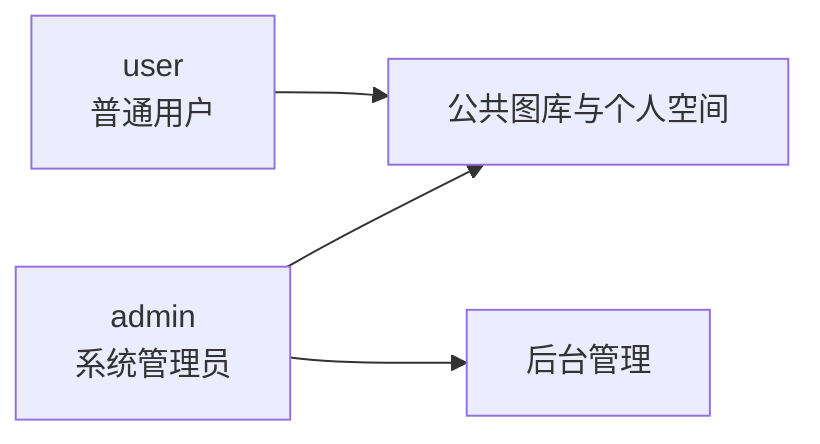
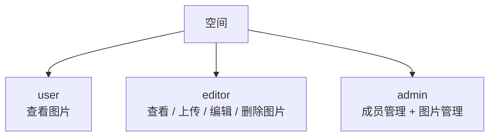

# 权限模型

PicSpace 同时使用系统角色和空间角色。系统角色决定是否具备后台能力，空间角色决定用户在某个空间内能做什么。

## 系统角色



| 角色 | 能力 |
| --- | --- |
| `user` | 使用图片和空间功能 |
| `admin` | 拥有用户、图片、空间、数据分析等后台管理能力 |

## 空间角色



| 角色 | 权限 |
| --- | --- |
| `user` | `picture:view` |
| `editor` | `picture:view`、`picture:upload`、`picture:edit`、`picture:delete` |
| `admin` | `spaceUser:manage`、`picture:view`、`picture:upload`、`picture:edit`、`picture:delete` |

## 权限校验入口

| 注解 | 用途 |
| --- | --- |
| `@AuthSysUser` | 要求用户已登录 |
| `@AuthSysAdmin` | 要求系统管理员角色 |
| `@SaCheckPermission` | 要求具备指定空间权限 |
| `@CheckSpacePermission` | 空间权限相关扩展注解 |

权限配置文件：

```text
pic-space-backend/src/main/resources/biz/spaceUserAuthConfig.json
```

## 典型校验场景

- 上传空间图片需要 `picture:upload`。
- 编辑空间图片需要 `picture:edit`。
- 删除空间图片需要 `picture:delete`。
- 管理空间成员需要 `spaceUser:manage`。
- 访问私有空间图片时，必须是空间成员。
