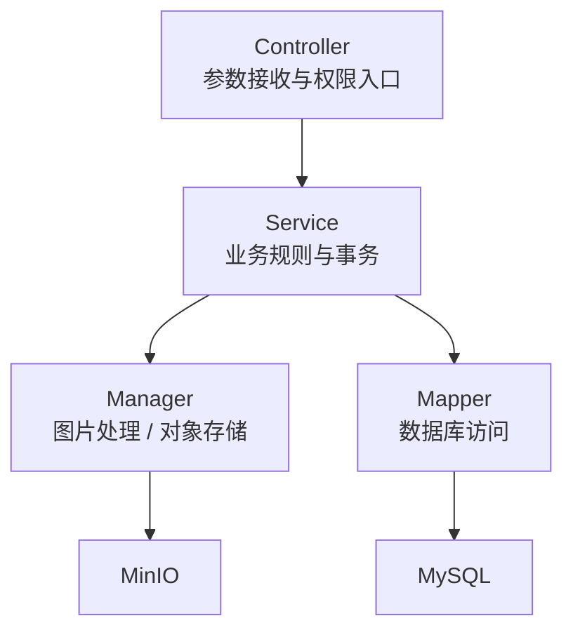

# 后端架构

后端基于 Spring Boot 2.7 和 Java 17 构建，核心代码位于 `pic-space-backend/src/main/java/io/ryan/picspace`。

## 目录结构

| 目录 | 说明 |
| --- | --- |
| `controller` | REST API 控制器 |
| `service` / `service.impl` | 业务接口与实现 |
| `mapper` | MyBatis-Plus Mapper |
| `model/entity` | 数据库实体 |
| `model/dto` | 请求 DTO |
| `model/vo` | 响应视图对象 |
| `auth` | 登录、系统角色、空间权限 |
| `manager` | 文件上传、图片处理等领域管理器 |
| `config` | MyBatis、JSON、对象存储、Sa-Token 等配置 |
| `exception` | 业务异常与全局异常处理 |

## 分层职责



## 关键控制器

| 控制器 | 路由前缀 | 职责 |
| --- | --- | --- |
| `UserController` | `/user` | 注册、登录、当前用户、用户查询 |
| `UserControllerAdmin` | `/user` | 管理员用户增删改查 |
| `PictureController` | `/picture` | 用户侧图片上传、查询、编辑、删除 |
| `PictureControllerAdmin` | `/picture` | 管理员图片审核、批量抓取、后台查询 |
| `SpaceController` | `/space` | 用户侧空间创建、查询、编辑、删除 |
| `SpaceControllerAdmin` | `/space` | 管理员空间查询与更新 |
| `SpaceUserController` | `/spaceUser` | 空间成员管理 |
| `DataAnalysisController` | `/dataAnalysis` | 后台数据分析 |

## 响应结构

所有接口统一返回：

```json
{
  "code": 0,
  "data": {},
  "message": "ok"
}
```

异常由全局异常处理器转换为同样的响应格式。

## 数据访问

项目使用 MyBatis-Plus，实体字段未开启下划线转驼峰：

```yaml
mybatis-plus:
  configuration:
    map-underscore-to-camel-case: false
```

因此数据库字段与 Java 实体字段保持同名风格，例如 `userAccount`、`spaceId`、`reviewStatus`。
