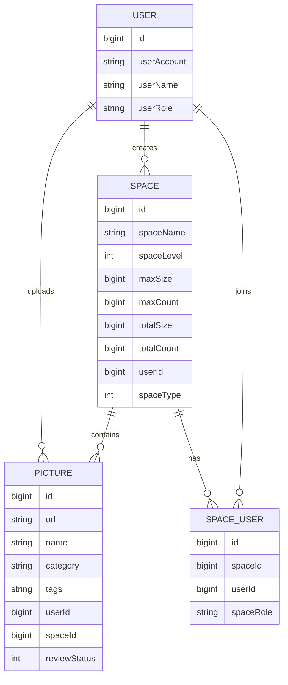

# 数据模型

数据库初始化脚本位于 `pic-space-backend/sql/create_table.sql`。

## 实体关系

## user

用户表保存账号、密码、昵称、头像、简介和系统角色。

| 字段 | 说明 |
| --- | --- |
| `userAccount` | 登录账号，唯一 |
| `userPassword` | 加密后的密码 |
| `userRole` | `user` 或 `admin` |

## picture

图片表保存图片文件地址和图片元信息。

| 字段 | 说明 |
| --- | --- |
| `url` | MinIO 或外部可访问图片地址 |
| `name` | 图片名称 |
| `category` | 图片分类 |
| `tags` | JSON 数组字符串 |
| `picSize` | 图片体积 |
| `picWidth` / `picHeight` | 图片宽高 |
| `picScale` | 图片比例 |
| `picFormat` | 图片格式 |
| `hash` | 图片哈希，用于去重 |
| `reviewStatus` | 审核状态 |
| `spaceId` | 所属空间；为空表示公共图库 |

## space

空间表保存空间配额和统计数据。

| 字段 | 说明 |
| --- | --- |
| `spaceName` | 空间名称 |
| `spaceLevel` | 空间等级 |
| `maxSize` / `maxCount` | 空间容量与数量上限 |
| `totalSize` / `totalCount` | 当前已使用容量与图片数量 |
| `spaceType` | `0` 私有空间，`1` 团队空间 |

## space_user

空间成员表保存用户与空间之间的角色关系。

| 字段 | 说明 |
| --- | --- |
| `spaceId` | 空间 ID |
| `userId` | 用户 ID |
| `spaceRole` | `user`、`editor` 或 `admin` |

`spaceId + userId` 建有唯一索引，确保同一用户在同一空间内只有一个角色。
