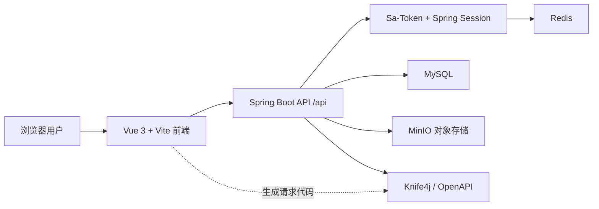

# 总体架构

PicSpace 采用前后端分离架构。前端负责页面交互、路由、状态管理和接口调用；后端负责认证授权、业务校验、数据持久化、文件对象存储和 OpenAPI 文档输出。

## 模块边界

| 模块 | 目录 | 职责 |
| --- | --- | --- |
| 后端服务 | `pic-space-backend` | REST API、业务服务、权限校验、数据库访问、对象存储 |
| 前端应用 | `pic-space-frontend` | 页面、组件、路由、登录态处理、接口请求 |
| 项目文档 | `docs` | VitePress 文档站点 |

## 主要业务域

- 用户域：注册、登录、注销、当前用户、后台用户管理。
- 图片域：图片上传、URL 导入、编辑、删除、审核、分类标签、列表查询。
- 空间域：创建空间、空间等级、空间容量限制、空间信息维护。
- 协作域：空间成员、空间角色、空间权限。
- 分析域：后台数据概览与趋势统计。

## 请求链路

1. 用户在 Vue 前端发起请求。
2. Axios 携带 Cookie 调用后端 `/api/*` 接口。
3. 后端通过全局响应结构返回 `{ code, data, message }`。
4. 未登录时返回 `40100`，前端拦截后跳转到登录页。
5. 需要空间权限的接口由 Sa-Token 权限注解进行拦截。
6. 图片文件进入 MinIO，图片元信息和空间统计进入 MySQL。
